# GOOGLE BUSSINESS INTELLIGENCE PROJECT : Cyclistic Bike Share

## System Requirements

**Tools Used :**

- **Tableau :** Familarity with Tableau UI.
- **Excel :** Familarity with Excel. USE Pivot Table and Power Query before.

  Google Business Intelligence License (69f62442ac83acf9883d) and

  Certification:    [click here

  ](https://coursera.org/share/69f62442ac83acf9883df43f8725e200)

  

Dataset used:

As this dataset is more than 1GB so I'm going to upload it to : [Cyclistic Bike Share Dataset](https://drive.google.com/drive/folders/16MQJ6CQW-_tiZsoHRnMredfOzvulW_eA?usp=sharing)

## 1. Working with Excel - Power Query Editor.

1. Open your Ms Excel with new file or new sheet.
2. Then, click on `Data` tab shown in the image below
   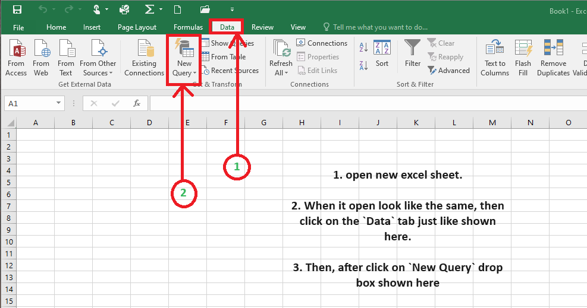
3. Now you are able to see, multiple options like, from files, from databases, from Azure and other resources select from files and click it. Then, after it shows from workbook, from XML, from CSV , from Text and from Folder opthion select and click that last option.
   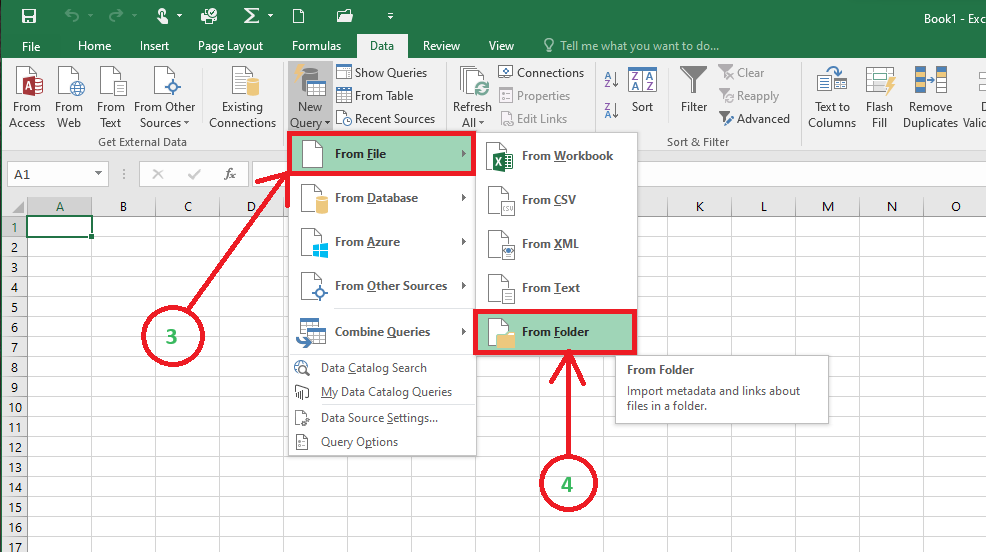
4. Now, you have the option to select the path of that folder or you can simply browse it from the button given there. Select the folder and then click ok!
   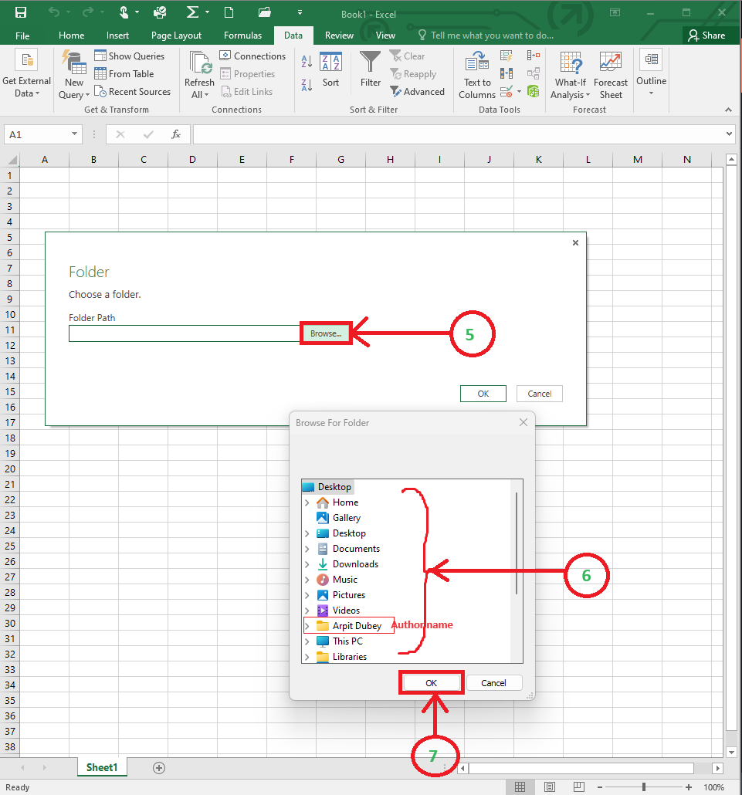
5. After clicking the ok button, our power query editor will open with the files that folder containing
   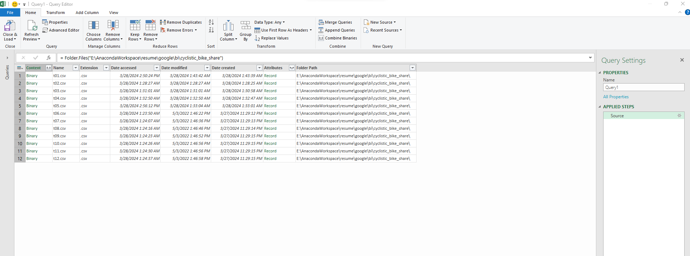

## Power Query Editor in Excel

1. For more and better understandings, I changed the `Query 1` file name to `bike_data` you can do it using the Query Settings option
   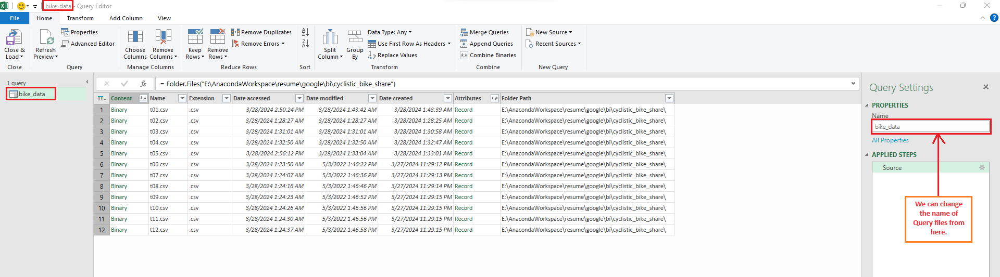
2. We have 12 files and for all of them counted as rows and we have 8 columns created by the Power Query Editor
   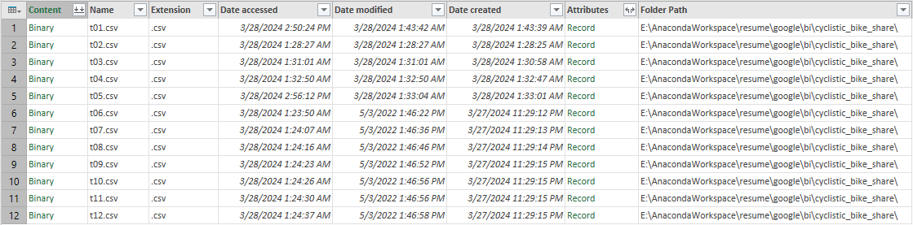
3. Here, we can see `Extention` feature so, to maintain the same or equal to a specific choice of extention containing files we can perform certain task to do that so. For that you have to click the down arrow as shown in extension feature

   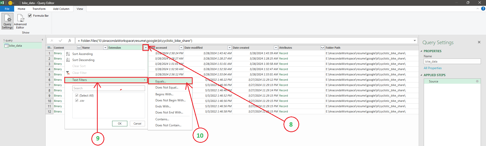

```python
f(x) = Table.SelectRows(Source, each [Extension] = ".csv")
```

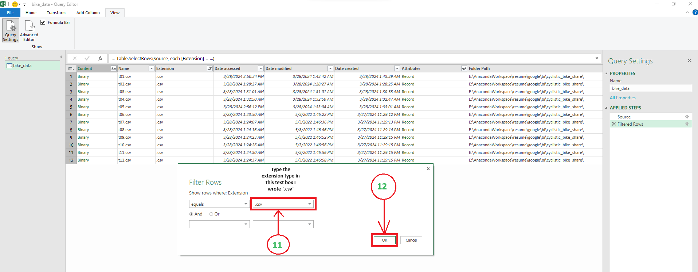

```python
f(x) = Table.SelectColumns(#"Filtered Rows",{"Content"})
```

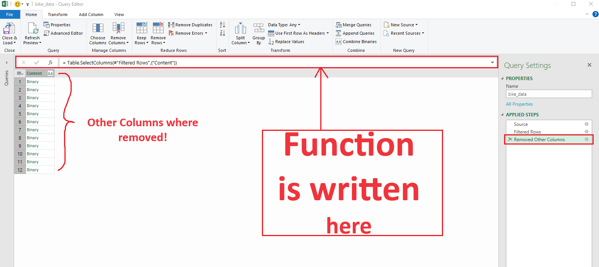

4. After removing other columns let's click on combine button shown in the below image.
   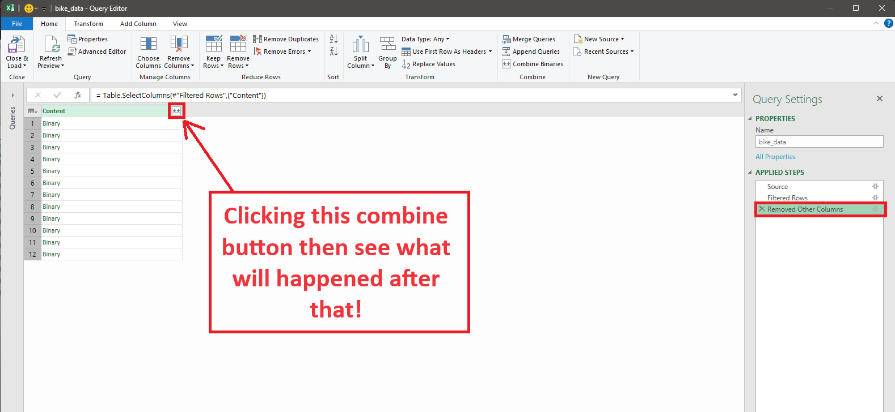
   After clicking it the Power Query editor performed some operation automatically, and combine binaries those operations shown in the below image.

   ```python
   f(x) = Binary.Combine(#"Removed Other Columns"[Content]) # Combine binaries
   f(x) = Csv.Document(#"Combined Binaries",[Delimiter=",",Encoding=1252]) # Imported Csv
   f(x) = Table.PromoteHeaders(#"Imported CSV") # Promoted headers
   f(x) = Table.TransformColumnTypes(#"Promoted Headers",{{"ride_id", type text}, {"rideable_type", type text}, {"started_at", type datetime}, {"ended_at", type datetime}, {"start_station_name", type text}, {"start_station_id", type text}, {"end_station_name", type text}, {"end_station_id", type text}, {"start_lat", type number}, {"start_lng", type number}, {"end_lat", type number}, {"end_lng", type number}, {"member_casual", type text}}) # Changed Type
   ```

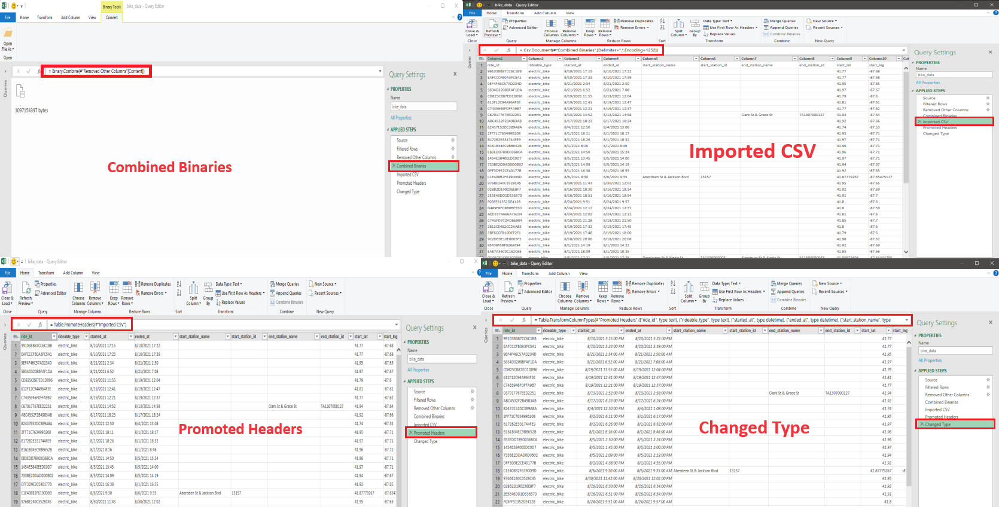

After clicking the combine button the Power Query performed 4 different functionalities:

- Combined Binaries
- Imported CSV
- Promoted Headers
- Changed Type

5. Now, we have some useful features and some are not here, I found out `ride_id` feature as an un-useful feature right now, let's remove it.

   ```python
   f(x) = Table.RemoveColumns(#"Changed Type",{"ride_id"})
   ```

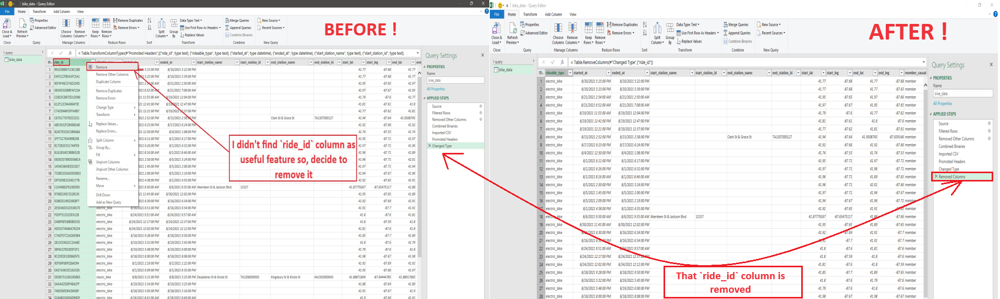

6. Now, we can see here in our dataset there are two features `started_at` and `ended_at` but these two features having values as combination of data and time which we have to separate into `start_date`, `start_time`, `end_date` and `end_time` so, further we can derived new features from them such as `duration_of_ride` of something like that.

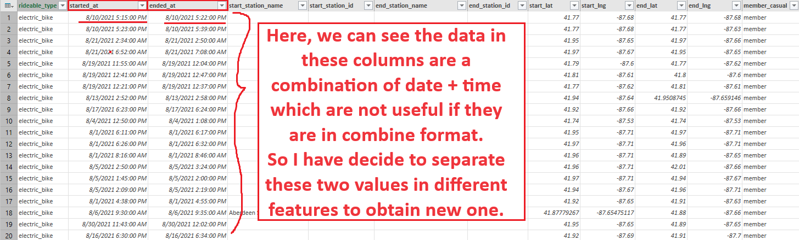

```python
f(x) = Table.DuplicateColumn(#"Duplicated Column1", "started_at", "started_at - Copy")
f(x) = Table.DuplicateColumn(#"Duplicated Column2", "started_at", "started_at - Copy.1")
f(x) = Table.DuplicateColumn(#"Duplicated Column1", "ended_at", "ended_at - Copy")
f(x) = Table.DuplicateColumn(#"Duplicated Column2", "ended_at", "ended_at - Copy.1")
```

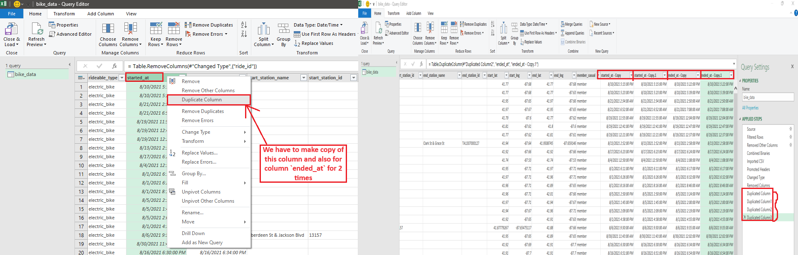

7. Now, let's change the name of these columns and change their types

   ```python
   f(x) = Table.RenameColumns(#"Duplicated Column3",{{"started_at - Copy", "start_date"}})
   ```

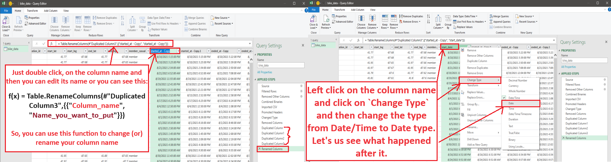

```python
f(x) = Table.TransformColumnTypes(#"Renamed Columns",{{"start_date", type date}})
```

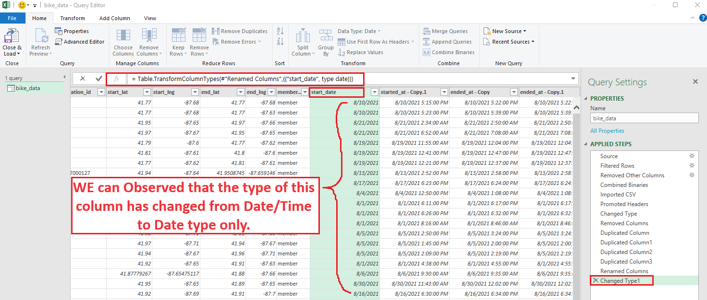

8. Change the name of another duplicated column to `start_hour` and then extract the hour values from it.

```python
f(x) = Table.RenameColumns(#"Extracted Time",{{"started_at - Copy.1", "start_hour"}})
```

then, extracting the hour values

```python
f(x) = Table.TransformColumns(#"Changed Type1",{{"start_hour", Time.Hour, Int64.Type}})
```

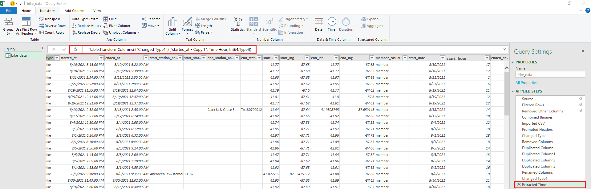

9. Same the above operations we can perform for `end_date` and `end_hour` columns to generate, let's do it

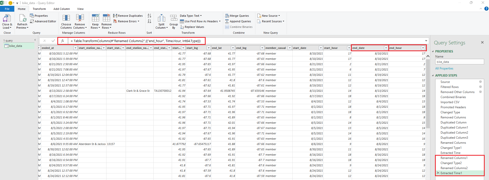

10. Now, let's add a custom column and named it as `trip_duration_minutes` and it's basically, the difference between the `end_hour` and `start_hour` in minutes.

```python
f(x) = Table.AddColumn(#"Extracted Time1", "trip_duration_minutes", each [ended_at] - [started_at])
```

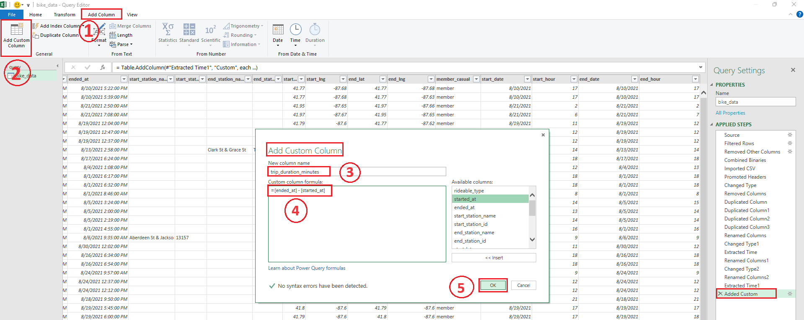

```python
f(x) = Table.TransformColumns(#"Added Custom",{{"trip_duration_minutes", Duration.Minutes, Int64.Type}})
```

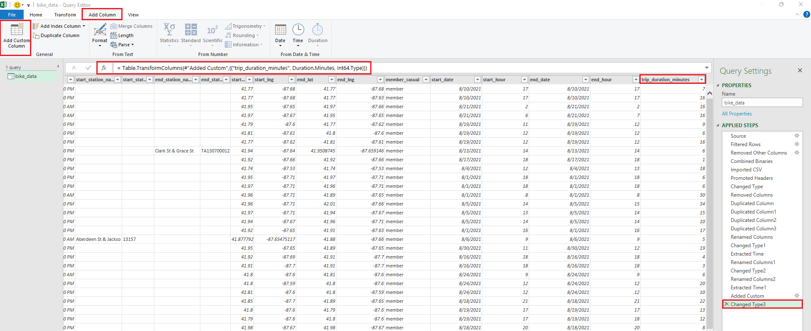

#### Q. Find out the number of counts of missing start station names in this cyclistic bike data?

Firstly, we have to find the feature named as `start_station_name` or similar then we have to filter the column using the down arrow button at the column name.

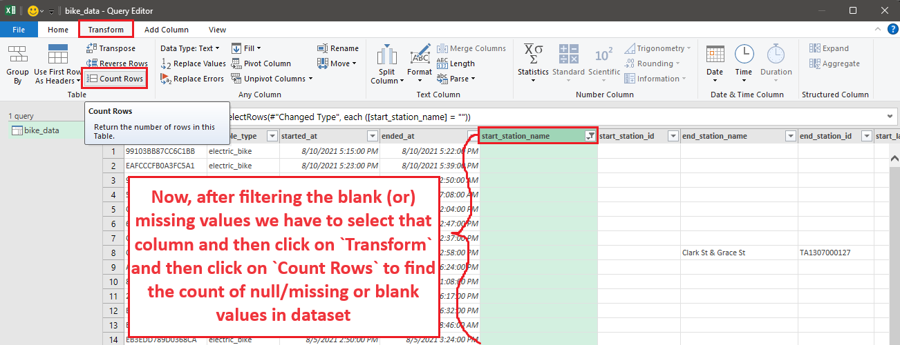

Now, after clicking the `Transform` tab and `count rows` we have **807778** rows which are blank/null/missing rows in this specific feature.

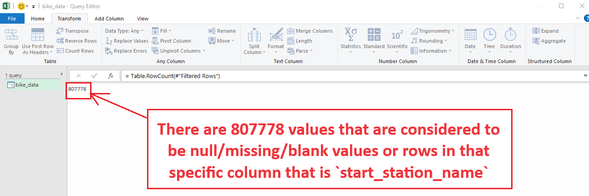

Similarly we can check other columns for enhancing analysis perspective. Done!

#### Q. Find out the rows which are having negative values in `trip_duration_minutes` column?

let's us see is there are any values which are 0 or less than in `trip_duration_minutes` column

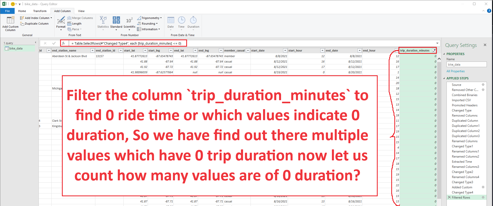

Firtly we have to filter the column using the same down arrow button then we have to select `Number filters` and then, click on `Less Than ...`


Then you have to put the value here we are going to find the negative value so we put less than 0.

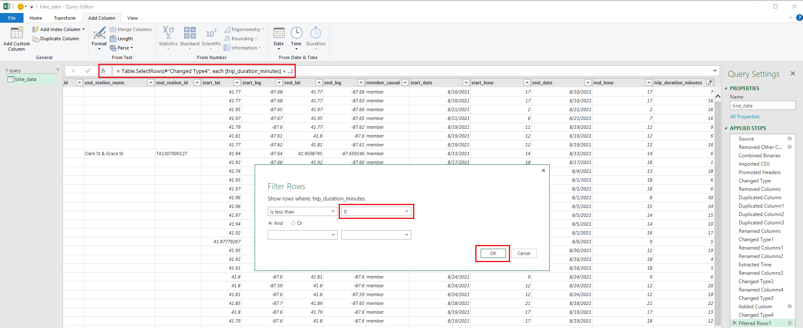

These are the rows which are containing negative values in `trip_durations_minutes`

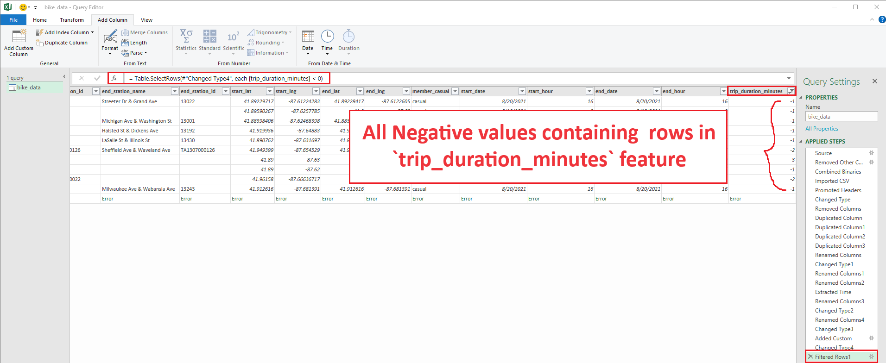

We have filter out the blank values and remove those values let's create a Pivot Table and draw out some Visualization and analyse that chart to make some conclusions.

#### **Q. Create a Visualisation :** We have to find out the time in a day where  the maximum rides are going to happened.

let's load our transformed data into excel sheet and then create a pivot table.

We load our transformed data 

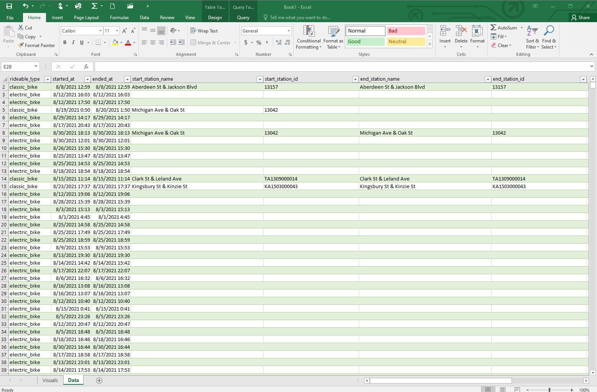

Now we are going to create the pivot table and our visualisation.

 let's create it


So as we can se I just create a pivot table and then drag the `start_hour` column into the ROWS field and then drag the same `start_hour` column into the VALUES field.

Now, We got some result but we have to find out the number of ride so we right click on the sum of start_hour and summarize the values as count.

we got the count of start_hour and then we further go with the intert tab and click on the Recomended chart. It provide the count chart which is helpful to create the accurate visualisation plot yes, we get this below bar chart.

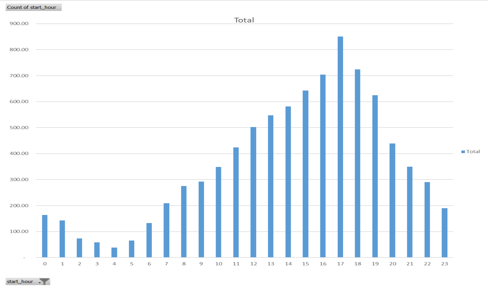

### Conclustion :

1. Around 4'O clock to 5'O clock the rides are maximum
2. Maximum rides are going to happened in 5 pm in evening time.
3. Traffic would maximum around 5 pm and minimum at 4 Am.
4. Around 2 Am to 4 Am the traffic or rides are minimum.
5. Minimum rides are going to happened in 4 Am in morning time
