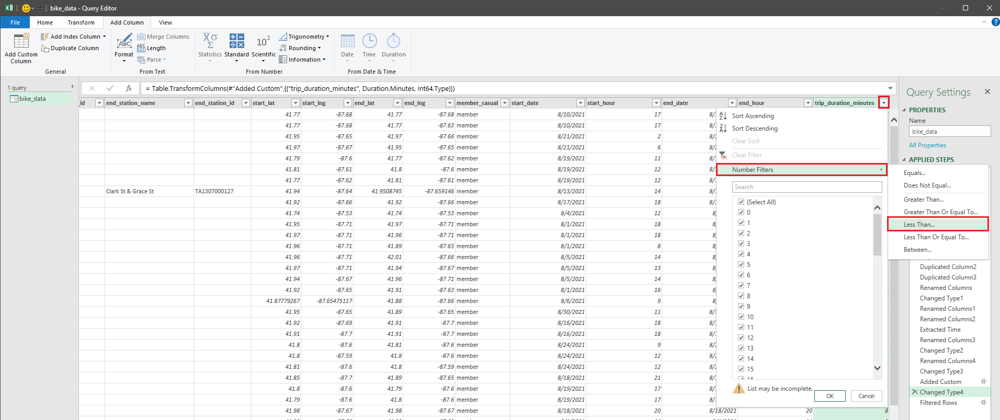

# GOOGLE BUSSINESS INTELLIGENCE And GOOGLE DATA ANALYTICS PROJECT : Cyclistic Bike Share and Diamond

## System Requirements

**Tools Used :**

* **Excel :** Familarity with Excel. USE Pivot Table and Power Query before.
* **Tableau :** Familarity with Tableau UI.

**Google Data Analytics Professional License (EET2T8PEFL4C) and Certification:**

[Click Here](https://coursera.org/share/2a7660b0c5befe96fbac9ce1a79f170b "/")


**Google Business Intelligence Professional License (6BR2UNAKERKS) and Certification:**

[Click Here](https://coursera.org/share/69f62442ac83acf9883df43f8725e200 "/")


Dataset used:

As this dataset is more than 1GB so I'm going to upload it to : [Cyclistic Bike Share Dataset](https://drive.google.com/drive/folders/16MQJ6CQW-_tiZsoHRnMredfOzvulW_eA?usp=sharing)

## 1. Excel And Power Query Editor.

1. Open your Ms Excel with new file or new sheet.
2. Then, click on `Data` tab shown in the image below
   
3. Now you are able to see, multiple options like, from files, from databases, from Azure and other resources select from files and click it. Then, after it shows from workbook, from XML, from CSV , from Text and from Folder opthion select and click that last option.
   
4. Now, you have the option to select the path of that folder or you can simply browse it from the button given there. Select the folder and then click ok!
   
5. After clicking the ok button, our power query editor will open with the files that folder containing
   

### Power Query Editor in Excel

1. For more and better understandings, I changed the `Query 1` file name to `bike_data` you can do it using the Query Settings option
   
2. We have 12 files and for all of them counted as rows and we have 8 columns created by the Power Query Editor
   
3. Here, we can see `Extention` feature so, to maintain the same or equal to a specific choice of extention containing files we can perform certain task to do that so. For that you have to click the down arrow as shown in extension feature

   

```python
f(x) = Table.SelectRows(Source, each [Extension] = ".csv")
```


```python
f(x) = Table.SelectColumns(#"Filtered Rows",{"Content"})
```


4. After removing other columns let's click on combine button shown in the below image.
   
   After clicking it the Power Query editor performed some operation automatically, and combine binaries those operations shown in the below image.

   ```python
   f(x) = Binary.Combine(#"Removed Other Columns"[Content]) # Combine binaries
   f(x) = Csv.Document(#"Combined Binaries",[Delimiter=",",Encoding=1252]) # Imported Csv
   f(x) = Table.PromoteHeaders(#"Imported CSV") # Promoted headers
   f(x) = Table.TransformColumnTypes(#"Promoted Headers",{{"ride_id", type text}, {"rideable_type", type text}, {"started_at", type datetime}, {"ended_at", type datetime}, {"start_station_name", type text}, {"start_station_id", type text}, {"end_station_name", type text}, {"end_station_id", type text}, {"start_lat", type number}, {"start_lng", type number}, {"end_lat", type number}, {"end_lng", type number}, {"member_casual", type text}}) # Changed Type
   ```


After clicking the combine button the Power Query performed 4 different functionalities:

- Combined Binaries
- Imported CSV
- Promoted Headers
- Changed Type

5. Now, we have some useful features and some are not here, I found out `ride_id` feature as an un-useful feature right now, let's remove it.

   ```python
   f(x) = Table.RemoveColumns(#"Changed Type",{"ride_id"})
   ```


6. Now, we can see here in our dataset there are two features `started_at` and `ended_at` but these two features having values as combination of data and time which we have to separate into `start_date`, `start_time`, `end_date` and `end_time` so, further we can derived new features from them such as `duration_of_ride` of something like that.


```python
f(x) = Table.DuplicateColumn(#"Duplicated Column1", "started_at", "started_at - Copy")
f(x) = Table.DuplicateColumn(#"Duplicated Column2", "started_at", "started_at - Copy.1")
f(x) = Table.DuplicateColumn(#"Duplicated Column1", "ended_at", "ended_at - Copy")
f(x) = Table.DuplicateColumn(#"Duplicated Column2", "ended_at", "ended_at - Copy.1")
```


7. Now, let's change the name of these columns and change their types

   ```python
   f(x) = Table.RenameColumns(#"Duplicated Column3",{{"started_at - Copy", "start_date"}})
   ```


```python
f(x) = Table.TransformColumnTypes(#"Renamed Columns",{{"start_date", type date}})
```


8. Change the name of another duplicated column to `start_hour` and then extract the hour values from it.

```python
f(x) = Table.RenameColumns(#"Extracted Time",{{"started_at - Copy.1", "start_hour"}})
```

then, extracting the hour values

```python
f(x) = Table.TransformColumns(#"Changed Type1",{{"start_hour", Time.Hour, Int64.Type}})
```


9. Same the above operations we can perform for `end_date` and `end_hour` columns to generate, let's do it


10. Now, let's add a custom column and named it as `trip_duration_minutes` and it's basically, the difference between the `end_hour` and `start_hour` in minutes.

```python
f(x) = Table.AddColumn(#"Extracted Time1", "trip_duration_minutes", each [ended_at] - [started_at])
```


```python
f(x) = Table.TransformColumns(#"Added Custom",{{"trip_duration_minutes", Duration.Minutes, Int64.Type}})
```


#### Q. Find out the number of counts of missing start station names in this cyclistic bike data?

Firstly, we have to find the feature named as `start_station_name` or similar then we have to filter the column using the down arrow button at the column name.


Now, after clicking the `Transform` tab and `count rows` we have **807778** rows which are blank/null/missing rows in this specific feature.


Similarly we can check other columns for enhancing analysis perspective. Done!

#### Q. Find out the rows which are having negative values in `trip_duration_minutes` column?

let's us see is there are any values which are 0 or less than in `trip_duration_minutes` column


Firtly we have to filter the column using the same down arrow button then we have to select `Number filters` and then, click on `Less Than ...`



Then you have to put the value here we are going to find the negative value so we put less than 0.


These are the rows which are containing negative values in `trip_durations_minutes`


We have filter out the blank values and remove those values let's create a Pivot Table and draw out some Visualization and analyse that chart to make some conclusions.

#### **Q. Create a Visualisation :** We have to find out the time in a day where  the maximum rides are going to happened.

let's load our transformed data into excel sheet and then create a pivot table.

We load our transformed data


Now we are going to create the pivot table and our visualisation.

 let's create it


So as we can se I just create a pivot table and then drag the `start_hour` column into the ROWS field and then drag the same `start_hour` column into the VALUES field.

Now, We got some result but we have to find out the number of ride so we right click on the sum of start_hour and summarize the values as count.

we got the count of start_hour and then we further go with the intert tab and click on the Recomended chart. It provide the count chart which is helpful to create the accurate visualisation plot yes, we get this below bar chart.


Then I want to see which type of customers uses the bikes either they are members (subscribers) or they are causal customers and in what season they prefer our bike cycles the most.

I choose line chart to represent the time-variation and the rides according to time.

Here, in below chart I filtered `member_casual` to casual and `rideable_type` to classic_bike


Here, in below chart I filtered `member_casual` to casual and `rideable_type` to docked_bike


Here, in below chart I filtered `member_casual` to casual and `rideable_type` to electric_bike


Here, in below chart I filtered `member_casual` to member and `rideable_type` to classic_bike


Here, in below chart I filtered `member_casual` to member and `rideable_type` to docked_bike


Here, in below chart I filtered `member_casual` to member and `rideable_type` to electric_bike


#### Observations:

1. Around 4'O clock to 5'O clock the rides are maximum
2. Maximum rides are going to happened in 5 pm in evening time.
3. Profit would maximum around 5 pm and minimum at 4 Am.
4. Around 2 Am to 4 Am the profit or rides are minimum.
5. Minimum rides are going to happened in 4 Am in morning time.
6. Electric bikes are more preferable by casual members
7. Classic bikes are more preferable for members
8. Peak bike usage are mostly, after work timing.
9. Docked bikes aren't preference by the annual members or subscribers
10. Summer casual member dominance and Winter revenue are from annual members.

#### Conclusion:

Summer times casual members preferably use electric bikes than members and In winter times most revenue generates from annual members. Peak usages of bikes are after 8 Am to 4 pm work timings or from 5 pm to 7pm. Electric bikes preference by casual members and Classic bikes preference by annual members.  Docked bikes are not prefer by the annual members.

---

## 2. SQL Analysis

first of all we have multiple files or data files from January to December 2022

We have to merge them all into a single data file for analysis

#### **Data Preparation**

```sql
--MERGE ALL JANUARY TO DECEMBER DATA FILES 

Select *  
INTO cyclistic_bike_share
From t01
UNION ALL 
SELECT *
FROM t02
UNION ALL 
SELECT *
FROM t03
UNION ALL 
SELECT *
FROM t04
UNION ALL 
SELECT *
FROM t05
UNION ALL 
SELECT *
FROM t06
UNION ALL 
SELECT *
FROM t07
UNION ALL 
SELECT *
FROM t08
UNION ALL 
SELECT *
FROM t09
UNION ALL 
SELECT *
FROM t10
UNION ALL 
SELECT *
FROM t11
UNION ALL 
SELECT *
FROM t12
  
SELECT *
FROM cyclistic_bike_share
```

After that we have seen in Excel and Power Query Analysis that the `started_at` and `ended_at` features having datetime data type and they are not separated in minutes, hours, days and months so, let's write query to separate them too.

#### **Data Cleaning**

```sql
  
  -- Separate minutes, hours, days and months into new folder 'annual_trip_data'

  IF OBJECT_ID('annual_trip_data', 'U') IS NOT NULL
  DROP TABLE annual_trip_data
  CREATE TABLE annual_trip_data
  (
  ride_id nvarchar(255),
  rideable_type nvarchar(255),
  started_at smalldatetime,
  ended_at smalldatetime,
  member_casual nvarchar(255),
  ride_length time(0),
  months nvarchar(255),
  weekdays nvarchar(255),
  hours int,
  duration_minutes int
);

INSERT INTO annual_trip_data
SELECT
  ride_id,
  rideable_type,
  started_at,
  ended_at,
  member_casual,
  ride_length,
  DATENAME(MONTH, started_at) AS months,
  DATENAME(WEEKDAY, started_at) AS weekdays,
  DATENAME (HOUR, started_at) AS hours,
  DATEDIFF(minute, started_at, ended_at) AS minutes_diff
FROM cyclistic_bike_share;

SELECT *
FROM annual_trip_data
WHERE member_casual is not null 
ORDER BY started_at ASC
```

#### **Data Analysis**

In this phase, Here focus is on understanding their behavior, preferences, and patterns to inform marketing strategies aimed at converting casual riders into annual members. To address the key findings, the following analyses were performed in SQL Server.

**Q1. Percentage of Casual Rides vs Annual Member?**

```sql
SELECT member_casual AS membership_type, 
COUNT (member_casual) AS total_ride, 
SUM (COUNT (member_casual)) OVER () AS total_membership,
CONCAT (CAST (COUNT (member_casual) * 100.0/ SUM (COUNT (member_casual)) OVER () AS DECIMAL (10,2)), '%') membership_percentage
FROM cyclistic_bike_share
WHERE member_casual IS NOT NULL
GROUP BY member_casual;
```

 

**Q2. Proportion of Rides by Bike Type?**

```sql
SELECT 
rideable_type AS bike_type,
member_casual AS membership_type,  
COUNT (rideable_type) AS individual_membership_count, 
SUM (COUNT (rideable_type)) OVER (Partition by rideable_type) AS total_membership,
CONCAT (CAST (COUNT (rideable_type) * 100.0/ SUM (COUNT (rideable_type)) OVER (Partition by rideable_type) AS Decimal (10,2)), '%') AS membership_percentage
FROM annual_trip_data
WHERE member_casual IS NOT NULL
GROUP BY rideable_type, member_casual
ORDER BY rideable_type;
```


**Q3. Percentage of Rides per Month?**

```sql
SELECT member_casual AS membership_type, months,
COUNT (months) AS membership_rides,
SUM (COUNT (months)) OVER (Partition by months) AS total_rides_per_month,
CONCAT (CAST ((COUNT (months)) * 100.0/ SUM (COUNT (months)) OVER (Partition by months) AS DECIMAL (10,2)), '%') AS membership_percentage
FROM analyze_annual_trip_data
WHERE member_casual is not null 
GROUP BY member_casual, months
ORDER BY 
CASE months
        WHEN 'January' THEN 1
        WHEN 'February' THEN 2
        WHEN 'March' THEN 3
        WHEN 'April' THEN 4
        WHEN 'May' THEN 5
        WHEN 'June' THEN 6
        WHEN 'July' THEN 7
        WHEN 'August' THEN 8
        WHEN 'September' THEN 9
        WHEN 'October' THEN 10
        WHEN 'November' THEN 11
        WHEN 'December' THEN 12
END, member_casual;
```

  

 **Q4. Number of Rides per Day?**

```sql
SELECT member_casual AS membership_type, 
weekdays,
COUNT (weekdays) AS rides_per_day
FROM analyze_annual_trip_data
WHERE member_casual is not null 
GROUP BY member_casual, weekdays
ORDER BY 
CASE weekdays
     WHEN 'Sunday' THEN 1 
	 WHEN 'Monday' THEN 2
	 WHEN 'Tuesday' THEN 3 
	 WHEN 'Wednesday' THEN 4
	 WHEN 'Thursday' THEN 5
	 WHEN 'Friday' THEN 6
	 WHEN 'Saturday' THEN 7 
END, member_casual;
```

**Q5. Average Ride Duration by Day (in minutes) ?**

```sql
SELECT member_casual AS membership_type, 
weekdays, 
AVG (duration_minutes) as ride_duration
FROM annual_trip_data
WHERE member_casual IS NOT NULL
GROUP BY member_casual, weekdays
ORDER BY 
CASE weekdays
     WHEN 'Sunday' THEN 1 
	 WHEN 'Monday' THEN 2
	 WHEN 'Tuesday' THEN 3 
	 WHEN 'Wednesday' THEN 4
	 WHEN 'Thursday' THEN 5
	 WHEN 'Friday' THEN 6
	 WHEN 'Saturday' THEN 7 
END, member_casual;
```


**Q6. Frequency of Rides per Hour?**

```sql
SELECT member_casual AS membership_type, 
hours,
COUNT(hours) AS rides_per_hour
FROM annual_trip_data
WHERE member_casual IS NOT NULL 
GROUP BY member_casual, hours 
ORDER BY hours, membership_type;
```


**Q7. Percentage of rides per Season?**

```sql
WITH cte AS 
(
   SELECT
      member_casual AS membership_type,
      CASE
         WHEN months IN ('December', 'January', 'February') THEN 'Winter'
         WHEN months IN ('March', 'April', 'May') THEN 'Spring'
         WHEN months IN ('June', 'July', 'August') THEN 'Summer'
         WHEN months IN ('September', 'October', 'November') THEN 'Autumn'
      END AS season
   FROM annual_trip_data
   WHERE member_casual IS NOT NULL
)
SELECT
   membership_type,
   season,
   COUNT(*) AS ride_per_season,
   SUM (COUNT (season)) OVER (Partition by season) AS total_rides_per_season,
   CONCAT (CAST (COUNT (season) * 100.0/ SUM (COUNT (season)) OVER (Partition by season) AS DECIMAL (10,2)), '%') AS percentage_per_season
FROM cte
GROUP BY membership_type, season
ORDER BY season, membership_type;
```


**Q8. Proportion of rides in Each Time Zone?**

```sql
WITH CTE AS 
(
   SELECT
   member_casual AS membership_type, duration_minutes AS ride_duration,
   CASE
      WHEN hours >= 0 AND hours < 6 THEN 'Night'
      WHEN hours >= 6 AND hours < 12 THEN 'Morning'
      WHEN hours >= 12 AND hours < 18 THEN 'Afternoon'
      WHEN hours >= 18 THEN 'Evening'
   END AS time_zone
   FROM annual_trip_data
   WHERE member_casual IS NOT NULL
)
SELECT 
  membership_type, time_zone,
  COUNT (time_zone) AS rides_per_time_zone,
  SUM (COUNT (time_zone)) OVER (Partition by time_zone) AS total_rides_per_time_zone,
  CONCAT (CAST (COUNT (time_zone) * 100.0/ SUM (COUNT (time_zone)) OVER (Partition by time_zone) AS DECIMAL (10,2)), '%') AS percentage_of_rides
  FROM cte 
  GROUP BY time_zone, membership_type
  ORDER BY time_zone, membership_type;
```


## 3. Tableau AQnalysis and Dashboard

Firstly, we have multiple files in our `Cyclistic Bike Share` Dataset, there are 12 files (for various months in a year 2022) now, to treat each different file we have to merge them in single file so we have to UNION them.

These are the files we have :


Now, In Tableau we have to merge these all files so we have to UNION them just like the below steps shown:


