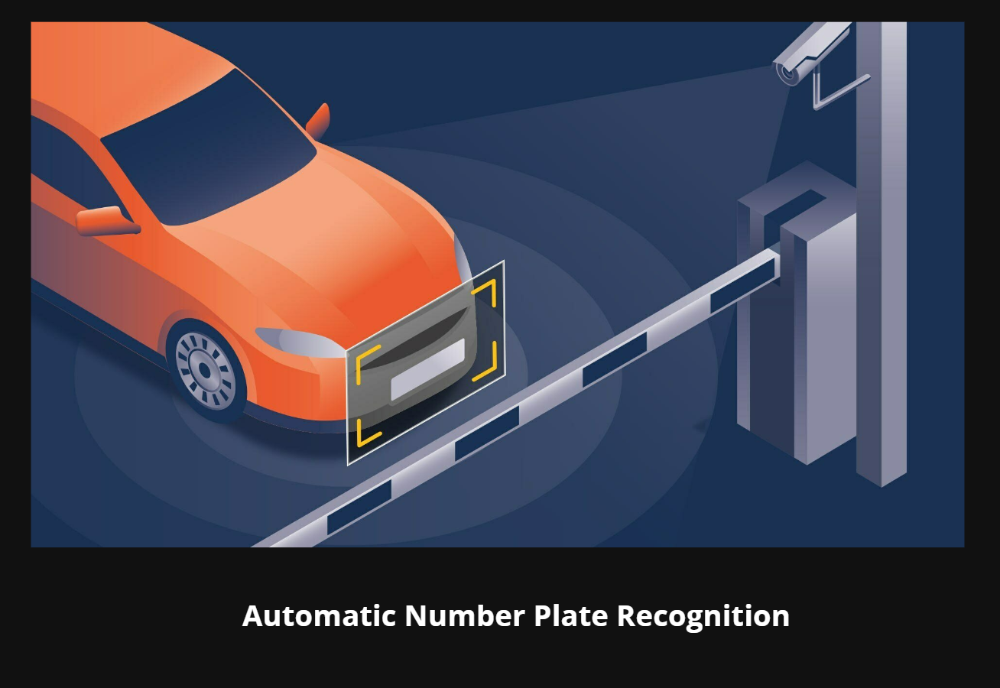
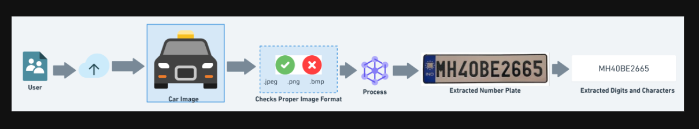
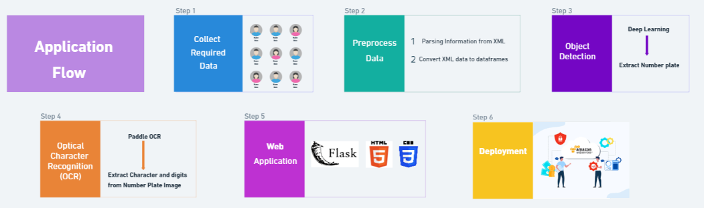

## Problem Statement

In the following project we will undestand to recognize the number plate automatically using Python, OpenCV and DeepLearning. Paddle OCR for character and digits extraction from car number plate.

## Application Flow

This Application is used to detect the number plates from the image of Cars and the image is our data.

The Application flow is set on six different different stages:

1. Collect Required Data
2. Preprocess Data
3. Object Detection
4. Optical Character Recognition (OCR)
5. Web Application
6. Deployment

**Collect Required Data :** The first step, is to collect the required data, in my case for this project I collect the required data from open source platform Kaggle for datasets. So, from Kaggle I get the zip file with which contains all the data (images) with their annotations (annotations are basically the xml files which contains all the details about the images or data).

**Preprocess Data :** In the second step, I have to preprocess the required data. I had parse the information (Bounding box information) from the annotations (XML files)  and also then convert the annotation (XML) data to the dataframes. Here, I had un-structured data so after preprocessing and converting step that un-structured data convert into structured data.

**Object Detection :** In step third, I had applied object detection technique using the Deep learning, to extract the number plate from the car's image. This step is basically, used to give the relevant portion from the image automatically, so we can segmentized the part of image accordingly.

**Optical Character Recognition (OCR) :** In step four, I had applied optical character recognition (ocr) technique using paddle ocr because at this stage still we have portion of image data or relevant portion of image data but I want to extract the characters written over that image data and also the numeric character or digits from the image.

**Web Application :** In fifth step, I'm going to design and deploy the application in web environment using the flask framework and using some basic html and css basic web technologies. This step indicates i had deploy the application in the development environment.

**Deployment :** In step six, at this step I had already create and deploy the object detection or deep learning application in Development environment but the actual deployment is creating a pipleline to the cloud deployment or production-ready environment this step indication the actual deployment in the Production environment. It is the work of DevOps or MLOps or AIOPs  Engineer. I select the AWS Cloud for this step and for this application.

### Application Flow Diagram

I had created this simple diagram to show the above steps.

## Use cases of Automatic Number Plate Detection:

Automatic Number Plate Recognition (ANPR) technology has various real-time use cases that provide significant benefits in different sectors. In today's world, security is becomming a major concern for most of the organisation, institutions, corporates and essentials services. In that sense the security is the primary concern or a priority for any Organisation for that possibily, in parking areas many times rules, laws were broken un-intentionally or intentionally. Here are some common use cases along with their explanations:

1. **Vehicle Parking :** ANPR is commonly used in vehicle parking management systems to automate entry and exit processes. When a vehicle enters a parking lot, ANPR cameras capture the vehicle's license plate, allowing for accurate and efficient tracking of parked vehicles. This technology can also help in managing parking space availability and enabling automated payment systems.
2. **Toll Enforcement :** ANPR is extensively used in toll enforcement systems to identify vehicles passing through toll booths without paying the required fees. By capturing license plate details, ANPR technology enables authorities to track and penalize offenders effectively.
3. **Vehicle Surveillance :** ANPR plays a crucial role in vehicle surveillance applications by monitoring and tracking vehicles in real-time. Law enforcement agencies use ANPR to identify stolen vehicles, track wanted vehicles, and enhance overall security. By integrating ANPR with surveillance systems, authorities can quickly locate and apprehend suspicious or unauthorized vehicles.
4. **Traffic Control :**  ANPR technology is widely used in traffic control scenarios to manage traffic flow, monitor congestion, and enforce traffic regulations. By capturing license plate data, ANPR systems can detect vehicles violating traffic laws, such as speeding or running red lights. This information enables authorities to take immediate action and improve overall traffic management.
5. **Access Control and Security:** ANPR is used for access control and security purposes in various facilities such as airports, corporate offices, and residential complexes. By automatically identifying vehicles entering or exiting premises, ANPR systems help enhance security measures and streamline access management processes.
6. **Law Enforcement and Investigations:** ANPR technology is instrumental in law enforcement and investigations by providing valuable data on vehicle movements and identifying suspects involved in criminal activities. Police agencies use ANPR to track suspect vehicles, locate missing persons, and gather evidence for investigations.
7. **Smart City Initiatives:** ANPR plays a critical role in smart city initiatives by facilitating efficient traffic management, enhancing public safety, and improving urban planning. By leveraging ANPR technology, cities can implement data-driven solutions for transportation optimization, emergency response coordination, and sustainable urban development.

   

These use cases demonstrate the versatility and effectiveness of ANPR technology in various applications, showcasing its value in enhancing operational efficiency, improving security measures, and enabling data-driven decision-making.
