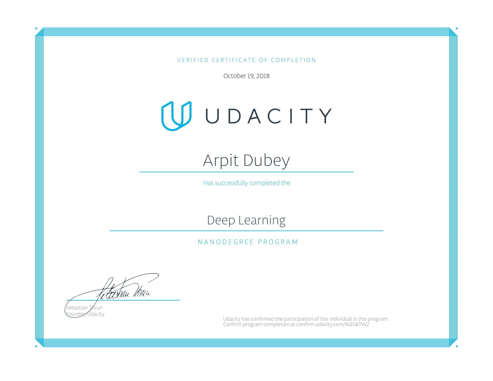
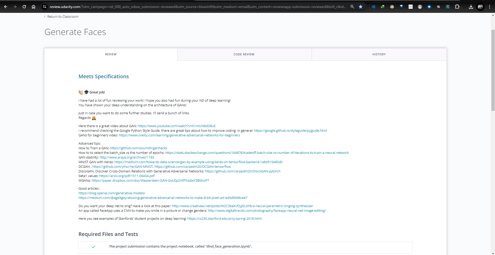

# UDACITY DEEP LEARNING NANO DEGREE

Udacity Deep Learning Nano Degree : [click here](https://www.udacity.com/certificate/NJDJ6YWZYWZ "deep learning nano degree") and for this project rubics reviews : [click here](https://review.udacity.com/?utm_campaign=ret_000_auto_ndxxx_submission-reviewed&utm_source=blueshift&utm_medium=email&utm_content=reviewsapp-submission-reviewed&bsft_clkid=ee02acaf-30ca-42d8-a2cf-392023bd02df&bsft_uid=23bba4a4-5998-4a02-903e-a5107625f797&bsft_mid=c7e10d91-356a-4beb-8321-4ae1e15cee25&bsft_eid=6f154690-7543-4582-9be7-e397af208dbd&bsft_txnid=33c2bdc7-92ff-4bb1-a9d9-4ef9647f00c3#!/reviews/1440538 "click here for review")



Passed by Mentors: 


Review of this project: 

`Meets Specifications`
👏 🎓 Great job!

I have had a lot of fun reviewing your work! I hope you also had fun during your ND of deep learning!
You have shown your deep understanding on the architecture of GANs!

Just in case you want to do some further studies, I’ll send a bunch of links.
Regards :bowtie:

Here there is a great video about GAN: https://www.youtube.com/watch?v=X1mUN6dD8uE
I recommend checking the Google Python Style Guide, there are great tips about how to improve coding, in general: https://google.github.io/styleguide/pyguide.html
GANs for beginners video: https://www.oreilly.com/learning/generative-adversarial-networks-for-beginners

Advanced tips:
How to Train a GAN: https://github.com/soumith/ganhacks
How to to select the batch_size vs the number of epochs: https://stats.stackexchange.com/questions/164876/tradeoff-batch-size-vs-number-of-iterations-to-train-a-neural-network
GAN stability: http://www.araya.org/archives/1183
MNIST GAN with Keras: https://medium.com/towards-data-science/gan-by-example-using-keras-on-tensorflow-backend-1a6d515a60d0
DCGAN : https://github.com/yihui-he/GAN-MNIST, https://github.com/carpedm20/DCGAN-tensorflow
DiscoGAN, Discover Cross-Domain Relations with Generative Adversarial Networks: https://github.com/carpedm20/DiscoGAN-pytorch
beta1 values: https://arxiv.org/pdf/1511.06434.pdf
WGANs: https://paper.dropbox.com/doc/Wasserstein-GAN-GvU0p2V9ThzdwY3BbhoP7

Good articles :
https://blog.openai.com/generative-models/
https://medium.com/@ageitgey/abusing-generative-adversarial-networks-to-make-8-bit-pixel-art-e45d9b96cee7

Do you want your deep net to sing? Have a look at this paper: http://www.creativeai.net/posts/W2C3baXvf2yJSLbY6/a-neural-parametric-singing-synthesizer
An app called FaceApp uses a CNN to make you smile in a picture or change genders: http://www.digitaltrends.com/photography/faceapp-neural-net-image-editing/

Here you see examples of Stanfords’ student projects on deep learning: https://cs230.stanford.edu/proj-spring-2018.html

Required Files and Tests
The project submission contains the project notebook, called “dlnd_face_generation.ipynb”.

All the unit tests in project have passed.

Build the Neural Network
The function model_inputs is implemented correctly.

The function discriminator is implemented correctly.

👍 Great work! You have used batch_normalization, leaky relus and sigmoid activation on a dense layer!

Original Paper on batch normalization: https://arxiv.org/pdf/1502.03167.pdf

The function generator is implemented correctly.

Awesome work!
☑️ batch_normalization
☑️ leaky relus
☑️ tanh activation

kernel size: https://www.quora.com/How-can-I-decide-the-kernel-size-output-maps-and-layers-of-CNN

The function model_loss is implemented correctly.

Great job on this difficult function! 👍

The function model_opt is implemented correctly.

Good idea using tf.control_dependencies!

Neural Network Training
The function train is implemented correctly.

It should build the model using model_inputs, model_loss, and model_opt.
It should show output of the generator using the show_generator_output function
👍 Great implementation! You have also rescaled batch_image data from [-0.5, 0.5] to [-1, 1]

The parameters are set reasonable numbers.

Absolutely reasonable values on your hyperparameters!

My suggestions on hyperparams on this project are:
batch_size: 16, 32, 64

* If you choose a batch size too small then the gradients will become more unstable and you would need to reduce the learning rate. So batch size and learning rate are linked.
* Also if one use a batch size too big then the gradients will become less noisy but it will take longer to converge.
  z_dim: 100-128
  learning_rate: 0.0002 - 0.0008
  Lowering the learning rate would require more epochs (in this project you are asked not to modify nb of epochs), but could ultimately achieve better accuracy.
  beta1: about 0.5 see: https://arxiv.org/pdf/1511.06434.pdf (Student also reported good results with values like 0.2 or 0.3)

The project generates realistic faces. It should be obvious that images generated look like faces.

Your GAN generates realistic looking images. You have proven to understand the architecture of GANs!`

## Meets Specifications

:👏: :🎓: **Great job!**

I have had a lot of fun reviewing your work! I hope you also had fun during your ND of deep learning!
You have shown your deep understanding on the architecture of GANs!

Just in case you want to do some further studies, I’ll send a bunch of links.
Regards ::bowtie::

Here there is a great video about GAN: [https://www.youtube.com/watch?v=X1mUN6dD8uE](https://www.youtube.com/watch?v=X1mUN6dD8uE)
I recommend checking the Google Python Style Guide, there are great tips about how to improve coding, in general: [https://google.github.io/styleguide/pyguide.html](https://google.github.io/styleguide/pyguide.html)
GANs for beginners video: [https://www.oreilly.com/learning/generative-adversarial-networks-for-beginners](https://www.oreilly.com/learning/generative-adversarial-networks-for-beginners)

Advanced tips:
How to Train a GAN: [https://github.com/soumith/ganhacks](https://github.com/soumith/ganhacks)
How to to select the batch_size vs the number of epochs: [https://stats.stackexchange.com/questions/164876/tradeoff-batch-size-vs-number-of-iterations-to-train-a-neural-network](https://stats.stackexchange.com/questions/164876/tradeoff-batch-size-vs-number-of-iterations-to-train-a-neural-network)
GAN stability: [http://www.araya.org/archives/1183](http://www.araya.org/archives/1183)
MNIST GAN with Keras: [https://medium.com/towards-data-science/gan-by-example-using-keras-on-tensorflow-backend-1a6d515a60d0](https://medium.com/towards-data-science/gan-by-example-using-keras-on-tensorflow-backend-1a6d515a60d0)
DCGAN : [https://github.com/yihui-he/GAN-MNIST](https://github.com/yihui-he/GAN-MNIST), [https://github.com/carpedm20/DCGAN-tensorflow](https://github.com/carpedm20/DCGAN-tensorflow)
DiscoGAN, Discover Cross-Domain Relations with Generative Adversarial Networks: [https://github.com/carpedm20/DiscoGAN-pytorch](https://github.com/carpedm20/DiscoGAN-pytorch)
beta1 values: [https://arxiv.org/pdf/1511.06434.pdf](https://arxiv.org/pdf/1511.06434.pdf)
WGANs: [https://paper.dropbox.com/doc/Wasserstein-GAN-GvU0p2V9ThzdwY3BbhoP7](https://paper.dropbox.com/doc/Wasserstein-GAN-GvU0p2V9ThzdwY3BbhoP7)

Good articles :
[https://blog.openai.com/generative-models/](https://blog.openai.com/generative-models/)
[https://medium.com/@ageitgey/abusing-generative-adversarial-networks-to-make-8-bit-pixel-art-e45d9b96cee7](https://medium.com/@ageitgey/abusing-generative-adversarial-networks-to-make-8-bit-pixel-art-e45d9b96cee7)

Do you want your deep net to sing? Have a look at this paper: [http://www.creativeai.net/posts/W2C3baXvf2yJSLbY6/a-neural-parametric-singing-synthesizer](http://www.creativeai.net/posts/W2C3baXvf2yJSLbY6/a-neural-parametric-singing-synthesizer)
An app called FaceApp uses a CNN to make you smile in a picture or change genders: [http://www.digitaltrends.com/photography/faceapp-neural-net-image-editing/](http://www.digitaltrends.com/photography/faceapp-neural-net-image-editing/)

Here you see examples of Stanfords’ student projects on deep learning: [https://cs230.stanford.edu/proj-spring-2018.html](https://cs230.stanford.edu/proj-spring-2018.html)

## Required Files and Tests

The project submission contains the project notebook, called “dlnd_face_generation.ipynb”.

All the unit tests in project have passed.

## Build the Neural Network

The function model_inputs is implemented correctly.

The function discriminator is implemented correctly.

:👍: Great work! You have used batch_normalization, leaky relus and sigmoid activation on a dense layer!

Original Paper on batch normalization: [https://arxiv.org/pdf/1502.03167.pdf](https://arxiv.org/pdf/1502.03167.pdf)

The function generator is implemented correctly.

Awesome work!
☑️ batch_normalization
☑️ leaky relus
☑️ tanh activation

kernel size: [https://www.quora.com/How-can-I-decide-the-kernel-size-output-maps-and-layers-of-CNN](https://www.quora.com/How-can-I-decide-the-kernel-size-output-maps-and-layers-of-CNN)

The function model_loss is implemented correctly.

Great job on this difficult function! :👍:

The function model_opt is implemented correctly.

Good idea using tf.control_dependencies!

## Neural Network Training

The function train is implemented correctly.

* It should build the model using `model_inputs`, `model_loss`, and `model_opt`.
* It should show output of the `generator` using the `show_generator_output` function

:👍: Great implementation! You have also rescaled batch_image data from [-0.5, 0.5] to [-1, 1]

The parameters are set reasonable numbers.

Absolutely reasonable values on your hyperparameters!

My suggestions on hyperparams on this project are:
batch_size: 16, 32, 64

```
* If you choose a batch size too small then the gradients will become more unstable and you would need to reduce the learning rate. So batch size and learning rate are linked.
* Also if one use a batch size too big then the gradients will become less noisy but it will take longer to converge.
```

z_dim: 100-128
learning_rate: 0.0002 - 0.0008
Lowering the learning rate would require more epochs (in this project you are asked not to modify nb of epochs), but could ultimately achieve better accuracy.
beta1: about 0.5 see: [https://arxiv.org/pdf/1511.06434.pdf](https://arxiv.org/pdf/1511.06434.pdf) (Student also reported good results with values like 0.2 or 0.3)

The project generates realistic faces. It should be obvious that images generated look like faces.

Your GAN generates realistic looking images. You have proven to understand the architecture of GANs!

---



